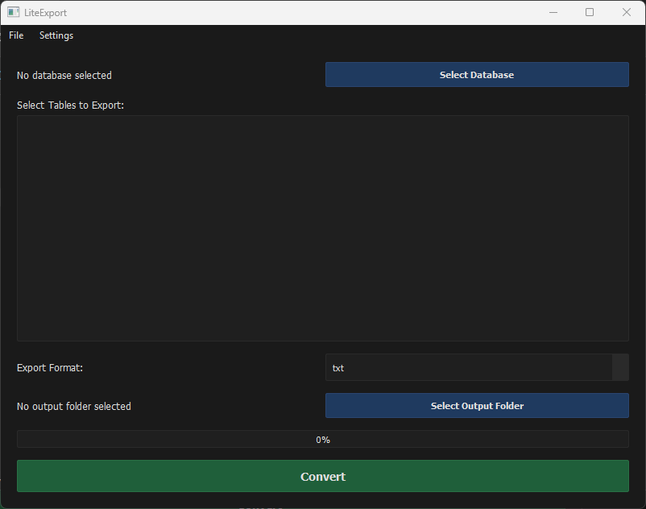

# LiteExport

**LiteExport** is a lightweight, GUI-powered SQLite export tool built with Python and PyQt5.  
It allows you to export tables from `.sqlite` or `.db` files into clean, readable formats such as:

- TXT  
- CSV  
- JSON  
- HTML

No CLI skills required — just point, click, and export.

---

## 📸 Preview



---

## 🚀 Features

- Export multiple tables at once
- Choose from 4 different output formats
- Chunked export to handle large databases smoothly
- Simple, fast, and responsive PyQt5 interface
- Real-time progress feedback
- Modern dark/light theme support
- User-friendly interface with tooltips
- Multi-table selection with clear visual feedback
- Professional and clean design

---

## 🎨 Themes

LiteExport comes with two beautiful themes:

- **Dark Theme**: Professional dark interface with easy-on-the-eyes colors
- **Light Theme**: Clean and modern light interface

Switch between themes easily from the Settings menu.

---

## 📁 Project Structure

```bash
LiteExport/
├── img/
│   └── screenshot.png
├── src/
│   ├── themes/
│   │   ├── dark.css
│   │   └── light.css
│   ├── converter.py
│   ├── main.py
│   └── ui.py
├── .gitignore
├── LICENSE
├── README.md
└── requirements.txt
```

---

## 📆 Installation

Make sure you have Python 3.10+ installed.

```bash
git clone https://github.com/Efeckc17/LiteExport.git
cd LiteExport
pip install -r requirements.txt
python src/main.py
```

---

## 🔪 Requirements

- Python 3.10+
- PyQt5

---

## 📝 License

This project is licensed under the MIT License.  
See [LICENSE](LICENSE) for more details.

---

## 👌 Author

Made with 💻 by [@Efeckc17](https://github.com/Efeckc17)

