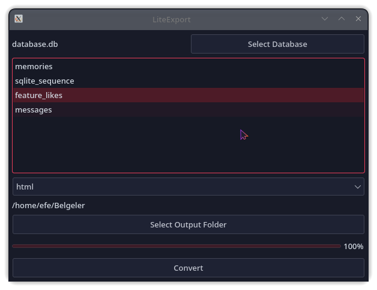

# LiteExport

**LiteExport** is a lightweight, GUI-powered SQLite export tool built with Python and PyQt6.  
It allows you to export tables from `.sqlite` or `.db` files into clean, readable formats such as:

- TXT  
- CSV  
- JSON  
- HTML

No CLI skills required — just point, click, and export.

---

## 📸 Preview



---

## 🚀 Features

- Export multiple tables at once
- Choose from 4 different output formats
- Chunked export to handle large databases smoothly
- Simple, fast, and responsive PyQt6 interface
- Real-time progress feedback

---

## 📁 Project Structure

```bash
LiteExport/
├── src/
│   ├── main.py
│   ├── ui.py
│   ├── converter.py
│   └── screenshot.png
├── output/                  # Output folder for exported files
├── requirements.txt
├── LICENSE
└── README.md
```

---

## 📆 Installation

Make sure you have Python 3.10+ installed.

```bash
git clone https://github.com/Efeckc17/LiteExport.git
cd LiteExport
pip install -r requirements.txt
python src/main.py
```

---

## 🔪 Requirements

- Python 3.10+
- PyQt6

---

## 📝 License

This project is licensed under the MIT License.  
See [LICENSE](LICENSE) for more details.

---

## 👌 Author

Made with 💻 by [@Efeckc17](https://github.com/Efeckc17)

